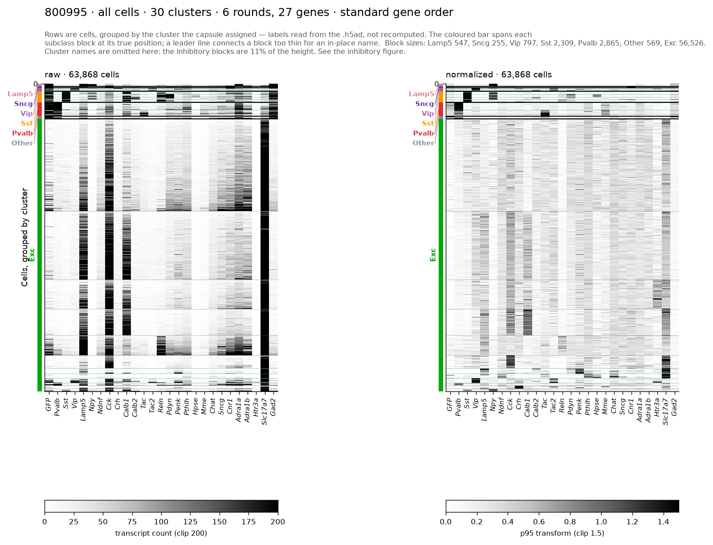
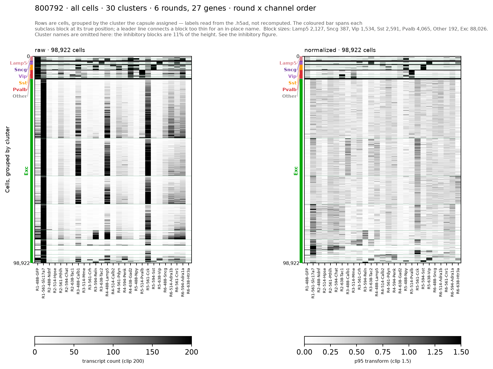
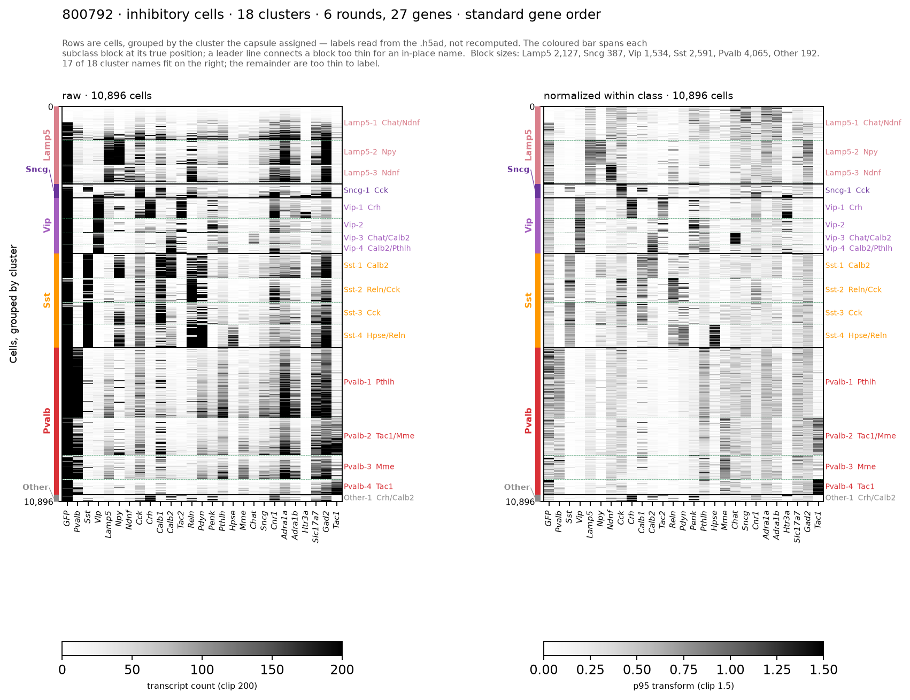
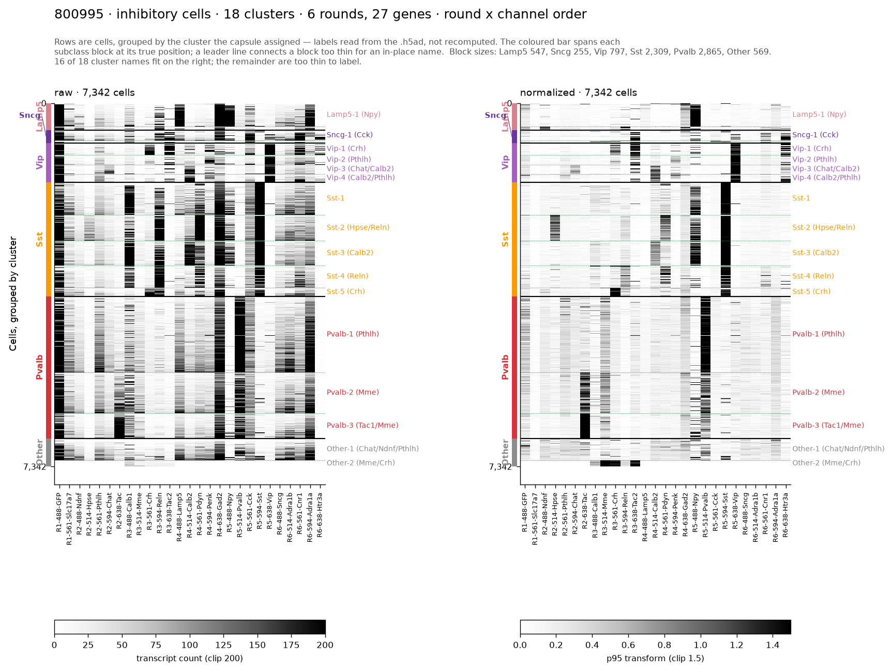

# aind-hcr-pairwise-unmixing-calibrated

Crosstalk removal ("unmixing") for thick-tissue HCR spot tables.

**Calibrated** is the point of the name. The prior pairwise implementation decided what
to delete using constants and in-data heuristics; every quantity this version acts on is
instead tied to an independent measurement:

| quantity | calibrated against |
|---|---|
| which channel pairs may bleed | the single-dye control experiment (one probe per sample) |
| how much they bleed | that control, scaled by the round's own laser powers, then re-measured on spatially isolated spots |
| how far a spot may deviate and still count as bleed | a measured percentile of the same isolated-spot population, per direction |
| what a pure dye looks like | spots with no other-channel neighbour, so they cannot be ghosts |

Nothing in the removal rule is a tuned constant.

**This repository is standalone.** It does not import from, depend on, or modify
[`aind-spot-spectral-unmixing`](https://github.com/mattjdavis/aind-spot-spectral-unmixing)
or the capsule that uses it. Both remain untouched; run the calibrated version from its
own capsule against the same data assets.

## What the calibrated version does differently

The upstream pairwise stage removes crosstalk by finding same-cell overlapping spots in
adjacent channel pairs and deleting whichever fits its own dye line worse. The calibrated
version keeps that core idea — a ghost sits on top of its source and has a predictable brightness — and
changes six things, each because a measurement said so. The numbered rationale for each
is in the section that follows.

| change | why |
|---|---|
| geometric QC **not applied**; flags passed through | The original computes three gates — `dist < 1.25` (spot centre vs. its fitted centroid, in voxels), `r > 0.25` (correlation to the fitted PSF), `dist_r > 1.0` — into a `valid_spot` flag and applies it at cell × gene construction. The calibrated version applies **none** of them: `dist` and `r` are written through as raw columns and the decision is made explicitly downstream. Audited over 66,059,174 spots (both mice, R2–R5), `dist_r > 1.0` is a no-op by construction, and the other two flag mostly clumped or merged detections rather than junk — real signal a single-spot model fits badly. **Consequence:** on 800995 R5 this leaves 2,083,186 extra spots (12.2%) in the delivered table relative to the original |
| dye lines from **spatially isolated** spots | the old "brightest in its own channel" purity rule is circular — in one mouse 93% of Sst spots peak in the Cck channel *because of* the bleed being measured. The isolated-spot estimate lands within 1° of what the single-dye control independently predicts |
| bleed magnitude and tolerance **measured per direction** | the inherited 1.5× tolerance had no derivation. The bleed ratio is not constant: flat for bright spots, rising for dim ones (a background floor). The calibrated version fits on the bright quartile of isolated spots and measures the tolerance as an upper percentile of the same labelled set |
| allowlist is **control-derived and bidirectional** | apparent bleed between distant channels is co-expression, not leakage — co-expressed genes are deliberately placed in non-neighbouring channels precisely because bleed there is negligible. But a pair that bleeds one way bleeds both, and the control's asymmetry does not hold in tissue (Vip/Sst: 7.6× predicted, 1.5–3.7× measured) |
| deletion needs spatial **and** magnitude **and** spectral evidence; undecidable spots flagged, not deleted | *Is co-location meaningful, or would spots land on top of each other anyway at this density?* Test: shift every source spot 24 µm sideways and re-run the search. On directions the control certifies as bleeding, real co-location runs **212–870× above** that shifted control, so a partner is genuine evidence rather than crowding. But the brightness test has a limit: a source spot dim enough that its *predicted* bleed (β × source) falls at or below the victim channel's own noise floor — taken as the 10th percentile of that channel's intensities — gives the test no dynamic range. Such spots are marked `v3_ambiguous` and kept, rather than silently deleted or silently retained |
| output **unfiltered**, carrying raw fg and local bg | the delivered table keeps only FG−BG, which cannot tell 300-over-100 from 300-over-900. Retaining `fg`, `bg` and their difference in the result allows intensity thresholding prior to cell × gene construction if desired |

## What β is

β is a **bleed fraction**. For an ordered pair of channels it answers: how much intensity
does one dye deposit in another channel, relative to how much it deposits in its own?

> **β(source → victim) = (that dye's intensity in the victim channel) ÷ (its intensity in
> its own channel)**

Both readings come from the **same spot** — every detected spot carries an intensity in all
five channels at its own location, so a single Sst transcript might read
`[12, 30, 210, 240, 18]`: brightest in its own channel (594) but with a substantial 561
reading that is pure bleed. β is the typical ratio of those two numbers, so it is a property
of the dye pair and the imaging conditions, not of any individual spot.


*Sst(594) → Cck(561) in mouse 800995 round 5.* **A** one real spot's five readings: 496 in
Cck's channel with no Cck molecule present, 300 in its own. **B** β is that ratio, 1.65 for
this spot. **C** the estimation pool: 1,981,893 Sst spots → 168,585 spatially isolated →
42,146 in the brightest quartile. **D** three independent routes converge — control 0.467,
control × power ratio 1.401, measured on isolated spots 1.354. **E** the test in the
intensity plane; gold is pure bleed, blue is genuine Cck, dashed is the deletion boundary.
**F** the tolerance is measured per direction and per mouse, not assumed.

A β above 1 means the bleed reads *brighter* than the source's own signal, which happens
when the victim channel is imaged at higher power — here 561 at 15% against 594 at 5%. The
calibrated version uses the measured value when available and the power-scaled control
prediction otherwise.

β is used in exactly one place, the magnitude test. A victim spot is consistent with pure
bleed when

> `victim intensity ≤ tolerance × β × source intensity`

### The tolerance

β is a *median* — the typical bleed ratio — but individual spots scatter around it, so a
strict `victim ≤ β × source` test would reject half of all true bleed. The tolerance is that
allowance, and it is **measured, not chosen**: spatially isolated source spots are a
labelled ground-truth set (their victim-channel reading is pure bleed by construction), so
the tolerance is simply an upper percentile of observed ÷ predicted on that set.

The percentile is a recall/precision dial, measured here for Sst→Cck in 800995:

| percentile | tolerance | catches this much true bleed | sweeps in this much genuine Cck |
|---|---|---|---|
| p75 | 1.43 | 75% | 1.6% |
| **p90** (default) | **2.77** | **90%** | **4.6%** |
| p95 | 3.65 | 95% | 7.3% |
| p99 | 5.93 | 99% | 23.1% |

p99 is where it breaks down — catching the last 1% of bleed costs a quarter of the genuine
signal.

**It is not one number for all channels.** Measured across the ten allowlisted directions it
spans **1.98 to 5.29**, a 2.7× range, and the same direction differs between mice (Npy→Pvalb:
2.12 in 800995, 5.29 in 788406). That spread is the argument against the inherited constant
of 1.5, which sits below every measured value. Per-direction values are in
`beta_tolerance_by_direction.csv`.

A `TOL_FLOOR` of 1.15 guards one degenerate case: if the isolated-spot ratio has almost no
spread the measured tolerance collapses toward 1.0 and the test becomes exact, which is
brittle. The floor never binds on real data — the lowest measured value is 1.98.

## How this differs from the original pairwise unmixing

The original is `mattjdavis/aind-spot-spectral-unmixing @ hack-for-capsule-mjd`
(`spot_analysis/unmixer.py`, `_unmix_spots_pairwise` / `_filter_pairwise_crosstalk`), as
run by `AllenNeuralDynamics/hcr-pairwise-spot-unmixing`. It is unmodified and still works
exactly as before; this table is a functional comparison, not a migration notice.

### Side by side

| | original pairwise | calibrated |
|---|---|---|
| **which pairs are checked** | a fixed adjacency list by channel count — for 5 channels `(488,514) (514,561) (561,594) (594,638) (488,594)`, hard-coded in `get_default_channel_pairs` | derived from the single-dye control: any ordered direction with β ≥ 0.05, plus the reverse of every such pair |
| **direction** | undirected — a pair is examined, and either member may be removed | directed — source → victim is decided by the control, and only the victim can be deleted |
| **dye line fit** | optimizer over the round's spot cloud (`ratio_calculator`), subset toward high-intensity spots in their own detection channel | component-wise median of spatially isolated spots (no other-channel spot within 1.5 µm), top 5% by own-channel brightness |
| **what decides deletion** | of two co-located spots, delete whichever has the larger distance to its own dye line — purely relative, no absolute criterion | four conditions, all required: spatial partner present, brightness consistent with measured β within a measured tolerance, five-channel fit favours the source, reverse direction does not explain it better |
| **bleed magnitude** | not used | measured per direction, per mouse, per round; control-predicted value used when the measurement is unavailable |
| **tolerance** | not applicable | measured as an upper percentile of observed ÷ predicted on isolated source spots (floor 1.15) |
| **spatial test** | `cKDTree.query_ball_point` with one isotropic radius (`min_dist`), on scaled coordinates | nearest-neighbour with an anisotropic box: 1.0 µm lateral, 1.3 µm axial, because a spot on a plane boundary can be binned one z-plane away |
| **same-cell requirement** | yes — overlaps in different cells are skipped (`unmixer.py:420`) | yes by default (`same_cell=True`), and switchable off per call. Kept because deleting across a segmentation boundary risks removing a real transcript assigned to a neighbouring cell |
| **laser power** | not used | read per round from that round's own `acquisition.json`; scales the control β |
| **geometric QC** | `apply_qc_filters` sets a `valid_spot` flag from `dist < CENT_CUTOFF`, `r > CORR_CUTOFF`, `dist_r > DIST_CUTOFF`; rows are not dropped, and the flag **is applied** at cell × gene construction (`cell_by_gene_table.py:76`) | gates are **not computed and not applied**; `dist` and `r` pass through as raw columns for the downstream step to use. On 800995 R5 that is 2,083,186 spots (12.2%) present in the calibrated cell × gene table that the original would have excluded |
| **spots with no partner** | kept, untouched | reassigned when the spectral evidence is strong; this is the rare case |
| **undecidable spots** | no such category | flagged `v3_ambiguous` and kept when predicted bleed falls under the victim channel's noise floor |
| **output** | filtered table: deleted spots are dropped, `unmixed_chan` = original channel | every input spot survives, with `v3_action`, `v3_chan`, `decision_rule`, `beta_used`, `beta_source`, NNLS coefficients, QC flags, and raw `fg` / `bg` |
| **iteration** | `keep` mask mutated in place across pairs, so a spot removed by one pair is invisible to later pairs | single pass; each direction is evaluated against the full spot set |

> **Migration note.** Because the calibrated version does not apply the geometric gates,
> its cell × gene counts are not directly comparable to the original's: on 800995 R5,
> 2,083,186 spots (12.2% of the delivered table) are present that the original would have
> excluded, *in addition to* every difference the unmixing itself makes. When comparing
> tables from the two pipelines, either apply `dist < 1.25 & r > 0.25` to the calibrated
> output first, or expect a systematic offset of roughly this size.

### Why each change was made

**Adjacency list → control-derived allowlist.** The fixed list includes `(561,594)` and
`(594,638)`, which do bleed, but also `(488,594)` — and treats all of them as equivalent.
Meanwhile an in-data measurement of every pair shows distant pairs with apparently huge
bleed ratios (up to 200× the control prediction). Those are **co-expressed genes**, placed
in non-neighbouring channels precisely because bleed there is negligible. Deleting on that
signal removes real biology. Two discriminators separate the causes: true bleed sits
sub-voxel on its source and scales with it; co-expression does neither.

**Undirected → directed.** "Delete whichever fits its own dye line worse" has no notion of
which dye is physically capable of contaminating which. When the two dye lines are close
together, that comparison is close to a coin flip.

**Relative fit → absolute, calibrated criterion.** The original never asks whether the
victim's brightness is *plausible as bleed*. A bright genuine spot that happens to sit near
a bright spot of a neighbouring gene can be deleted on a marginal difference in dye-line
distance. Requiring `victim ≤ tolerance × β × source`, with both β and tolerance measured,
makes deletion evidence-based rather than comparative.

**Optimizer fit → isolated-spot fit.** Subsetting toward high-intensity spots in their own
detection channel sounds like a purity filter but is circular: in one mouse 93% of Sst
spots are brightest in the Cck channel *because of* the bleed. The isolated-spot estimate
has no such feedback loop and lands within 1° of the control's independent prediction.

**Isotropic radius → anisotropic box.** Axial and lateral uncertainty differ. A single
radius either misses z-displaced ghosts or admits laterally distant chance co-locations.

**QC gates audited, one dropped.** Both versions annotate rather than drop, so this is a
smaller difference than it first appears — what the audit changed is which gates are
trusted. The three gates the capsule sets are:

| gate | what it measures | capsule value |
|---|---|---|
| `dist` | distance from the detected spot centre to its fitted centroid, in voxels | `< 1.25` |
| `r` | correlation between the spot and the fitted point-spread function | `> 0.25` |
| `dist_r` | ratio of a spot's distance to its *nearest* dye line over its *second-nearest* | `> 1.0` |

The audit covered every spot in both mice across rounds R2–R5 — 66,059,174 spots, 20
round × channel combinations — which is what makes the per-channel breakdown below
trustworthy rather than anecdotal.

`dist_r` is **a no-op at the capsule's setting**. It is a ratio of a smaller distance to a
larger one, so it is ≥ 1 for every spot by construction, and `> 1.0` therefore removes
0.00% in all four rounds. (The engine's own default is 4, which would remove 48–85%
depending on the round — a very different gate. The capsule overrides it to 1.0.)

`dist` and `r` do remove spots — 1.6–9.9% and 0.5–7.1% depending on channel. In **all 20**
round × channel combinations the spots they discard are *brighter* in their own channel than
the ones they keep (R2 Tac: median 133 vs 57; R3 Calb1: 160 vs 135). Two readings of that
are possible and they were tested against each other:

*Autofluorescence?* Bright non-transcript blobs would be bright in **every** channel, giving
an own-channel-to-other-channel ratio near 1. Measured on 800995 R5, the ratio *rises* when
the gate fails in four of five channels (638: 2.56 → 8.39; 514: 2.46 → 5.62), so the
discarded spots are **more** spectrally specific than the kept ones, not less. They do not
look like flat-spectrum autofluorescence.

*Saturated or merged spots?* Profiling `dist` and `r` against brightness within one channel
shows both degrade as spots get brighter — in 594/Sst the failure rate climbs from 0.3% in
the dimmest sixth to 17% around 377 counts. A tight cluster of transcripts fits a
single-spot PSF badly, so these gates are largely flagging **clumped or merged detections**:
real signal, but with a position and an amplitude that a single-spot model cannot represent.

Neither answer justifies discarding them silently, and neither justifies keeping them
unconditionally — a merged detection of three transcripts counted once undercounts, and its
centroid is unreliable. So the calibrated version computes nothing and applies nothing:
`dist` and `r` pass through as raw columns alongside `fg`, `bg` and `fg_over_bg`, and the
filtering decision is made explicitly at cell × gene construction. **This differs from the
original**, which applies its `valid_spot` flag there; see the note below on the size of
that difference.

**Co-location tested against a displaced null.** "The victim spot has a source spot on top
of it" is only evidence if spots don't land on top of each other by chance at these
densities — and these are dense samples (up to 13M spots in one channel). The test:
translate every source spot 24 µm along one axis and re-run the identical search. Any hits
now are pure chance. Measured on the four Sst/Cck/Vip directions in both mice, real
co-location runs **212–870× above** that shifted control (Sst→Vip in 800995: 8.9% of Vip
spots have a sub-voxel Sst partner, against 0.04% after displacement), so a partner is
genuine evidence.

The same test is a useful negative control. Cck→Vip — a distant pair, where the panel
places co-expressed genes precisely because bleed is negligible — comes in at only 28× and
34×, an order of magnitude below the real bleed directions. That is one of the two
discriminators behind excluding distant pairs from the allowlist.

**An explicit "cannot tell" category.** The brightness test asks whether a victim spot is
dim enough to be pure bleed from its partner. When the partner is itself dim, the predicted
bleed β × source can fall below the victim channel's own background — measured as the 10th
percentile of that channel's intensities — and the test has no dynamic range left. Rather
than deleting on a test that cannot discriminate, or silently keeping and pretending the
question was asked, those spots are flagged `v3_ambiguous` and passed through. Note the
criterion is on the *source* side: a plain victim-brightness cut would be wrong, because
real Cck spots are *dimmer* than true bleed into that channel (median 113 vs 180).

**Filtered output → annotated output.** A deleted row cannot be audited or reversed.
Downstream steps need to make their own thresholding decisions, which requires the raw
foreground and local background the original discards in favour of their difference.

### Still to decide: the delivered cell × gene table

The capsule should emit a cell × gene table alongside the spot-level results, which means
choosing filters — geometric and intensity — rather than leaving them implicit. Nothing is
settled here yet; what the audit has established so far:

| candidate filter | measured effect | status |
|---|---|---|
| `dist < 1.25 & r > 0.25` (the original's) | removes 12.2% on 800995 R5; the removed spots are brighter and more spectrally specific, consistent with clumped/merged detections | not applied; flags available |
| `dist_r > 1.0` | removes 0.00% by construction | dropped |
| `FG ≥ median(BG) + 2·MAD(BG)` per channel | removes 8.7–18.9% (800995) and 6.1–9.6% (788406); improves 9 of 16 marker-pair correlations but regresses Lamp5–Calb2 by +0.27 in **both** mice and costs 1,802 Gad2⁺ cells in one mouse against 18 in the other | tested, not adopted |
| per-spot `FG > 1.5 × BG` | removes 22–42%; the most even across channels because it means the same thing in each | untested end-to-end |
| `median(FG)` or `median(FG) − k·SD(FG)` | the first is a 50% rank cut by construction; the second is inert (negative in all five channels) | rejected |

The columns needed for any of these — `dist`, `r`, `fg`, `bg`, `fg_over_bg` — are all in the
spot-level output, so the choice can be made and revised without re-running the unmixer.

### Measured effect

Each value is a **Pearson correlation between two genes' per-cell transcript counts**
(log1p-transformed), computed across Gad2⁺ cells in one mouse, rounds R2–R5. The gene
pairs are markers of *different* interneuron subclasses, so they should rarely appear in
the same cell: a correlation near zero or below is the expected biology, and a strongly
positive one means one gene's spots are being counted inside the other's cells — the
signature of unresolved crosstalk. Lower is therefore better, and the three columns are
the same cells scored three ways.

| pair | no unmixing | original pairwise | calibrated |
|---|---|---|---|
| Sst–Cck (800995) | 0.712 | 0.711 | 0.214 |
| Sst–Cck (788406) | 0.717 | 0.560 | −0.345 |
| Npy–Pvalb (788406) | 0.787 | 0.509 | −0.334 |
| Npy–Pvalb (800995) | 0.292 | 0.132 | −0.290 |
| Sst–Vip (800995) | 0.441 | 0.394 | −0.317 |
| Lamp5–Calb2 (788406) | 0.617 | 0.456 | −0.340 |
| Calb1–Mme (800995) | 0.917 | 0.817 | 0.498 |

Cck–Vip is the exception and ends up worse than no unmixing at all: 0.393 → 0.470 in
800995 and 0.242 → 0.364 in 788406. The regression is specifically from admitting the
reverse directions — with the allowlist forward-only it reads 0.301 and −0.077, so the
bidirectional rule costs 0.17 and 0.44 on this pair while fixing Sst–Vip by ~0.52 on both
mice. The mechanism is the added Cck→Sst direction deleting Cck spots and re-correlating
Cck with Vip through shared depth loss. That direction has the highest sub-voxel
co-location rate of anything measured (0.585), which is suspicious rather than reassuring
given Cck is the densest channel, and it is the first thing to examine.


## Install

```bash
pip install -e .
pytest tests/          # synthetic ground truth; no data assets needed
```

## Use

```python
from aind_hcr_pairwise_unmixing_calibrated import pipeline

res = pipeline.run_mouse(
    asset_dir="/root/capsule/data/HCR_790322_pairwise-unmixing_...",
    mouse_id="790322",
    rounds=["R2", "R3", "R4", "R5"],
    gene_maps={"R2": {"488": "Ndnf", ...}, ...},
    processed_root="/root/capsule/data",
    output_dir="/root/capsule/results",
)
res["cellxgene"]      # cells x round-channel-gene
res["decisions"]      # per direction: which rule fired, how many spots moved
```

Or from a capsule (`code/run_capsule.py`):

```bash
python run_capsule.py --mouse-id 790322
```

Everything is written by default. The `--no-*` flags each drop one output:

| flag | drops | cost of dropping it |
|---|---|---|
| `--no-spots` | the per-round `*_unmixed_spots.parquet` tables | **Irrecoverable.** These are the only record of the per-spot decisions, and the cell × gene table cannot be rebuilt without them. Saves ~2 GB per 5-round mouse and most of the post-run upload. |
| `--no-anndata` | `*_cellxgene_annotated.h5ad` and, with it, the plots | Class / subclass / cluster labels. Re-derivable from `*_cellxgene.csv`. |
| `--no-plots` | `results/plots/` | Nothing — pure re-render from the `.h5ad`. |
| `--no-metadata` | `processing.json`, `data_description.json`, `asset_manifest.json`, copied schema files | Provenance, and the ability to register the result as an asset. |
| `--no-fgbg` | the `fg`/`bg` columns in the spot tables | Foreground/background intensities; the unmixing decisions themselves are unaffected. |

Also: `--rounds R2 R3` to restrict rounds, `--processed-folder` to pin which processed
asset supplies `acquisition.json` and the fg/bg join, and `--experimenter "Your Name"` to
fill `processor_full_name` in the metadata.

## Two things worth knowing before you run it

**Laser power must come from each round's own `acquisition.json`.** It varies more than
you would expect — R5 561 nm is 25% in mouse 804363, 15% in 800995 and 30% in 788406,
and R5 488 nm spans 5% to 30% across the same three — and β scales with the
victim/source power ratio. A stored per-round power table in the project belongs to
804363 alone and is wrong for every other subject.

**Choosing the processed asset is yours to make.** A mouse usually has several processed
assets, and they are not interchangeable for the fg/bg join: the per-channel
spot-detection tables must correspond to the same detections as the spot table being
unmixed. Resolution order:

1. `--processed-folder <name>` — an explicit choice, which overrides everything else.
2. `dataset_folder` from the round's `ds_config.json`, when that directory is present.
   This names the asset the pairwise-unmixing outputs were generated against, so it is
   the safe default.
3. Otherwise the **newest** processed asset for that mouse carrying `acquisition.json`.

Steps 2 and 3 are conveniences, not guarantees. If a mismatched asset slips through, the
fg/bg join is the tripwire: `run_round` raises when it matches under 99% of spots rather
than silently attaching the wrong intensities. Laser power is read from whichever asset
is chosen, so the choice matters even with `--no-fgbg`.

## Documentation

[`docs/unmixing_summary.pdf`](docs/unmixing_summary.pdf) — a 14-page plain-language
walkthrough of the whole problem and how this version addresses it, with 16 figures
embedded. Written for someone who has not followed the development: what ghost spots are,
why the earlier approaches fell short, what each step of the algorithm does and why, and
what remains open. Start here if you want the reasoning rather than the API.

[`docs/beta_explainer.png`](docs/beta_explainer.png) — the β figure from the section above,
standalone.

## Output files

Written to `/root/capsule/results`. `<M>` is the mouse id, `<R>` the round key.

### At a glance

A five-round mouse produces about **2.1 GB across ~21 files**. Where that goes, from the
782149 run of 2026-08-19:

| what | files | size | share |
|---|---|---|---|
| per-round spot tables | 5 | 2,032 MB | 96.7% |
| annotated cell × gene (`.h5ad`) | 1 | 6.8 MB | 0.3% |
| cell × gene table (`.csv`) | 1 | 1.7 MB | 0.08% |
| QC / audit CSVs | 3 | 10 KB | — |
| plots | 4 | ~60 MB | 2.9% |
| metadata JSON + run log | 7 | 190 KB | — |

The spot tables dominate. That is expected — they are one row per detected spot, 2–25 M
spots per round — and it is why `--no-spots` exists. They are still written by default,
because they are the only record of what the algorithm decided about each spot.

### Where each file comes from, and what it is for

| file | one row per | produced from | use it to |
|---|---|---|---|
| `<M>_<R>_unmixed_spots.parquet` | spot (all of them) | the round's `mixed_spots_<R>.pkl` from the pairwise-unmixing asset, plus fg/bg columns joined from the processed asset's `image_spot_detection/` | **The primary output.** Re-derive the cell × gene table under a different filter, audit an individual spot, or apply a stricter/looser policy than the default without re-running the algorithm. Nothing is deleted — `v3_action` records what a downstream step *should* do, so the raw detections stay auditable. One file per round because a round is 2–25 M spots. |
| `<M>_cellxgene.csv` | cell | spots where `v3_action == "keep"`, pivoted to cells × `round-channel-gene` and summed, joined across rounds on `cell_id` | Cell typing, clustering, any per-cell analysis. This is the deliverable most downstream work starts from. |
| `<M>_cellxgene_annotated.h5ad` | cell | the same matrix, plus `annotate.build_anndata()` labels and a depth-normalised layer | The same analyses with class / subclass / named-cluster labels already attached, and normalised counts in a layer. Use in preference to the CSV unless you need something the labelling would get in the way of. |
| `<M>_spot_change.csv` | round × channel | detection counts before and after the decisions | **Read this first after a run.** A channel losing 90% of its spots, or gaining any, is a red flag. Gene-level percent change per round × channel. |
| `<M>_decisions.csv` | round × bleed direction | the per-direction decision log | Find out *which* bleed direction moved a gene's count: which β was used and where it came from, the tolerance, how many spots were co-located, deleted, reassigned. |
| `<M>_separability.csv` | round × direction | the geometry of each channel pair's dye lines | Judge how much to trust a gene before using it. `angle_deg` is the angle between the two dye lines in 5-channel space, `auc` how well the intensity ratio separates the populations, `illcond` flags pairs under 25° where the least-squares test is dropped, `regime` the resulting policy. A small angle with AUC near 0.5 means unmixing had little to work with there, so residual contamination is expected rather than surprising. |
| `plots/*.png` | — | the annotated `.h5ad`'s own labels | Eyeball the result. Four heatmaps: all cells and inhibitory-only, each in biology-grouped and acquisition (round × channel) gene order. |
| `processing.json` | — | this run, appended to any upstream `processing.json` found | Provenance: one `DataProcess` with the repo URL and version, input and output locations, run parameters, and spot counts in/out. Accumulates rather than replacing history. |
| `data_description.json` | — | written fresh from the parent's descriptive fields | Names the asset (`HCR_<subject>_unmixed-calibrated_<timestamp>`), `data_level = "derived"`, `input_data_name` = the parent. |
| `asset_manifest.json` | — | the mounted asset folders plus the run's own results | What the registered data asset should be called, tagged and described — including every input asset consumed. Consumed by `tools/register_result_asset.py`; see below. |
| `subject.json`, `acquisition.json`, `procedures.json`, `instrument.json` | — | copied unchanged from the upstream processed asset | Describe the subject and acquisition, which unmixing does not alter. Copied so the derived asset is not orphaned from them. |
| `output` | — | stdout of the run | The run log: rounds, gene maps, per-round decision counts, the spot-change table, and what was written. First place to look when a run behaved unexpectedly. |

### Runtime and output size


Six rounds of 800995 take about 32 min of unmixing. The wall-clock you see in Code Ocean
is longer than the script's own timer reports, because **Code Ocean uploads `/results` to
S3 after the script exits** — that transfer is not inside any timer the run controls. The
spot tables dominate that volume, so they are written with zstd level 3 and narrowed
dtypes: 15.4 GB with pandas' snappy default becomes **6.3 GB**, verified value-identical
on a full round-trip. zstd is also marginally faster to write than snappy here, since
less output means less I/O.

If a run still feels slow after the "all N rounds unmixed" line, the remaining time is
the upload, not computation. `--no-spots` removes almost all of it, at the cost of the
per-spot decisions. The capsule prints two timings for that stretch: the cell x
gene shape (under a second) and a cumulative figure at the `.h5ad` write, which was 2s on
a real run. Benchmarked step by step on the six-round table of 800995:

| step | seconds |
|---|---|
| `cellxgene.csv` | 0.21 |
| three small CSVs | 0.03 |
| `build_anndata` | 1.15 |
| `write_h5ad` | 0.07 |
| `write_plots` (4 figures) | 2.00 |
| **total** | **3.46** |

So the whole tail is a few seconds against tens of minutes of upload. Note the figures are
written after the cumulative timing line prints, so they are not included in it.

### Plots

`results/plots/` gets four heatmaps, written from the annotated AnnData's own labels:

| file | cells | gene order |
|---|---|---|
| `cellxgene_all_std.png` | all | biology-grouped |
| `cellxgene_all_rc.png` | all | acquisition (round x channel) |
| `cellxgene_inhibitory_std.png` | inhibitory | biology-grouped |
| `cellxgene_inhibitory_rc.png` | inhibitory | acquisition |

Each shows raw counts beside the normalised matrix. Pass `--no-plots` to skip them; a
missing matplotlib degrades to a warning rather than losing the run's results.

Labels come from `obs.cluster` rather than being recomputed at plot time. That is
deliberate: recomputing means re-deriving cluster order from the matrix, and a label frame
whose row order differs from its cell-id order pairs every label with the wrong cells —
which looks like randomised data rather than a plotting bug.

### The spot table, column by column

Identity and position carried through from the input: `spot_id`, `spot_uid`,
`spot_uid_int`, `chan_spot_id`, `chan` (detection channel), `round`, `cell_id`,
`z`/`y`/`x` (voxel indices; physical spacing is 1.0 × 0.24 × 0.24 µm z/y/x).

Per-channel intensity: `chan_<C>_intensity` for each channel the round imaged —
background-subtracted, which is what every decision uses.

Upstream QC metrics, **annotated but never applied** (see the QC section):
`dist`, `r`, `over_thresh`. Filter on these yourself if you want to.

Raw brightness, present when `image_spot_detection/` was available:
`fg`, `bg`, `fg_over_bg` — foreground, local background, and their ratio, for
post-hoc intensity filtering at whatever threshold you choose.

The decision columns:

| column | meaning |
|---|---|
| `v3_action` | `keep`, `delete`, or `reassign`. **The only column a simple consumer needs.** |
| `v3_chan` | the channel this spot is attributed to after unmixing — differs from `chan` only for `reassign` |
| `v3_ambiguous` | `True` when the predicted bleed sat at or below the victim channel's noise floor, so the magnitude test had no dynamic range. These are **kept**, flagged rather than guessed |
| `crosstalk_source_chan` | for a deleted spot, which channel's dye it came from |
| `decision_rule` | which rule fired: `coloc_delete`, `coloc_delete_illcond`, `nnls_reassign_nopartner` |
| `beta_used` | the bleed fraction applied to this spot |
| `nnls_coef_own`, `nnls_coef_cross` | the two least-squares coefficients — own dye versus the source dye |

To reproduce the delivered cell × gene table from the spots:

```python
import pandas as pd
spots = pd.read_parquet("800995_R5_unmixed_spots.parquet")
kept = spots[spots.v3_action == "keep"]
counts = kept.groupby(["cell_id", "v3_chan"]).size().unstack(fill_value=0)
```

### The annotated `.h5ad`

```python
import anndata as ad
adata = ad.read_h5ad("800995_cellxgene_annotated.h5ad")
adata                       # e.g. 74,171 cells x 27 genes
```

**`adata.X`** — raw transcript counts, cells × genes. Integers.

**`adata.layers["normalized"]`** — the same matrix after the two-stage transform used
for clustering:

1. each cell divided by **its own mean gene count**, so the unit is "relative to this cell's typical gene" and detection depth divides out;
2. each gene divided by its own 95th percentile across cells, clipped to [0, 1], so a rare gene and an abundant one are comparable.

Cluster labels were computed on **this**, not on `X`: per-cell detection depth spans two
orders of magnitude, and raw counts cluster on depth rather than identity. k-means runs
on this matrix **directly** — no z-scoring, since stage 2 already puts every gene on a
common scale and re-inflating each to unit variance would give a gene detected in a
handful of cells the same weight as one carrying real structure.

The mean rather than the median in stage 1 is deliberate: with 27 genes a sparse cell's
median is often 0 (11,993 of 76,143 cells on 800995), and those cells cannot be scaled at
all. The mean is positive whenever any gene is detected, so no cell is dropped.

**`adata.var`** — one row per gene, with `round`, `channel`, `gene`. The index is
`R5-561-Cck` style, so the same gene imaged in two rounds stays distinguishable.

**`adata.obs`**

| column | meaning |
|---|---|
| `class` | `inhibitory` if ANY of Gad2, Pvalb, Vip, Sst, Npy is ≥ `MIN_CLASS_COUNTS` (100) **and**, when Slc17a7 also clears it, Gad2 specifically must too. Without that corroboration an excitatory cell carrying a moderate Pvalb reading is admitted: on 800995 that put 1,081 cells (14.4% of the class) into three clusters whose Slc17a7 medians were 743–806 with Gad2 medians of 26–76. Lamp5 is deliberately NOT an admission marker — it is expressed in 45% of all cells here, so gating on it admits most of the excitatory population; it remains a subclass gene. `excitatory` if Slc17a7 clears the threshold and no corroborated inhibitory marker does; `unassigned` if Gad2 and Slc17a7 both clear it (2,098 cells — usually merged cells or residual contamination) or nothing does |
| `subclass` | `Pvalb` / `Sst` / `Vip` / `Lamp5` for inhibitory clusters, by which canonical marker has the **highest expression** in the cluster, so the label never contradicts the heatmap. Enrichment (cluster mean ÷ across-cluster mean) is still applied as a floor of 1.2 on the winner, so a cluster with no marker standing out gets no subclass rather than whichever of four flat values was largest |
| `cluster` | readable name, e.g. `Pvalb-2 (Mme/Calb1/Cck)` — subclass, index within subclass, then the top differentially expressed genes. Subclass genes are excluded from the marker list, since the subclass is already the prefix |
| `cluster_id` | integer label; `-1` for cells that were not clustered (unassigned class) |
| `total_counts`, `n_genes` | per-cell depth and the number of genes detected |
| `<marker>_counts` | the raw counts of each class marker, so the gate is auditable |

**`adata.uns["unmixing"]`** — a nested record of how the labels were made:
`classification` (which markers were available, the count threshold, how many cells were
double-positive or neither), `clustering` (method, seed, per-class cluster count and the
name/subclass/enrichment of each), `normalization`, and `mouse_id` / `rounds`.

Clustering is computed **fresh from this matrix** — no external reference or
pre-existing labels are used, so cluster identity is not comparable across mice or
across runs unless you fit once and apply.

### Plotting it

Use the lab's `standard-cellxgene-plot-formatting` skill rather than hand-rolling a
heatmap. **Load it first** — `skill({skill: "standard-cellxgene-plot-formatting"})` in
Claude Science, which puts `cellxgene_heatmap`, `check_gene_panel` and
`normalize_cellxgene` into the kernel; the snippets below assume they are in scope and
raise `NameError` otherwise. Prefer it to a hand-written heatmap — it encodes the settled conventions (subclass-ordered rows, Allen/Tasic
subclass colour bars, the fixed 27-gene x-axis, `Subclass(markers)` cluster names, a
cell-count y-axis, empty-cluster QC). Load it, then convert the `.h5ad` into the
`(expr, cluster_labels, sorted_cell_ids)` triplet it expects:

```python
import anndata as ad
import pandas as pd

adata = ad.read_h5ad("800995_cellxgene_annotated.h5ad")   # 76,143 cells x 27 genes

def triplet(adata, cell_class=None):
    """(expr, cluster_labels, sorted_cell_ids) for the plotting skill."""
    a = adata if cell_class is None else adata[adata.obs["class"] == cell_class]
    a = a[a.obs.cluster_id >= 0]                          # drop unclustered cells
    X = a.X.toarray() if hasattr(a.X, "toarray") else a.X
    expr = pd.DataFrame(X, index=a.obs_names,
                        columns=a.var["gene"]).reset_index(names="cell_id")
    expr = expr.rename(columns={"Tac": "Tac1"})           # standard-order gene name
    labels = pd.DataFrame({"cell_id": a.obs_names,
                           "cluster": a.obs.cluster_id.to_numpy()})
    order = a.obs.sort_values(["cluster_id", "total_counts"]).index
    return expr, labels, pd.DataFrame({"cell_id": order})
```

`check_gene_panel` confirms the panel before you trust a figure — with all six rounds
it reports a full 27-gene match; a missing gene usually means a round was left out.

**All cells.** `include_excit=True` folds Slc17a7⁺ cells into one Excitatory block:

```python
expr, labels, ids = triplet(adata)
check_gene_panel([c for c in expr.columns if c != "cell_id"])

fig, summary, info = cellxgene_heatmap(
    expr, labels, ids,
    include_excit=True,
    display="normalized",        # or "raw" for transcript counts
    subtitle="800995 · all cells · 6 rounds, 27 genes",
    outfile="all_cells.png")
```

**Inhibitory only.** `include_excit=False`, since there is no excitatory block:

```python
expr, labels, ids = triplet(adata, cell_class="inhibitory")

fig, summary, info = cellxgene_heatmap(
    expr, labels, ids,
    include_excit=False,
    display="normalized",
    subtitle="800995 · inhibitory cells · 6 rounds, 27 genes",
    outfile="inhibitory.png")
```

Both figures show raw transcript counts beside the normalised matrix, and each comes
in two gene orders — the biology-grouped standard order, and acquisition
(`round_channel_order`, `R1-488-GFP … R6-638-Htr3a`) which makes round- and
channel-level artefacts visible as vertical bands:









`summary` is the per-cluster table (group, subclass, `Subclass(markers)` name, cell
count); `info` reports which clusters were dropped as empty. Both examples were run
against a real six-round `.h5ad` — the all-cells panel gives 32 clusters over 55,565
classified cells, the inhibitory panel 20 clusters over 3,401.

Note that `display=` controls only the colour scale: clustering was done on the
normalised matrix either way, so the two modes show the same rows in the same order.

### Runtime

A six-round mouse is roughly 8–12 min of unmixing on a `gr6.4xlarge`, plus download
time. Each round prints a 7-step progress line (`[3/7] dye lines ...`) and each
direction within step 6 is announced, so a long silence means a problem rather than
patience.

## Metadata (aind-data-schema)

The results directory is written as a proper derived asset, not a bare folder of CSVs:

- **Upstream schema files are carried forward unchanged.** `subject.json`,
  `acquisition.json`, `procedures.json`, `instrument.json`, `quality_control.json`,
  `rig.json`, `session.json` — these describe the subject and the acquisition, which
  unmixing does not alter, so copying them is correct. Whatever is absent upstream is
  skipped without complaint. Both the raw and the processed assets carry the full set,
  so pointing at either works.
- **`data_description.json` is written, not copied.** That file describes the *asset*,
  so copying the parent's would assert that our output is the parent. Following the
  convention the processed assets themselves use, the derived one gets
  `name = HCR_<subject>_unmixed-calibrated_<timestamp>`, `data_level = "derived"`, and
  `input_data_name = <parent>`, while inheriting subject, institution, modality,
  funding and licence unchanged. If no parent `data_description.json` is found, none is
  written — inventing those fields would be worse than omitting the file.
  `metadata.nd.json` is excluded for the same reason: it aggregates the others and would
  go stale immediately.
- **`processing.json` records this step.** One `DataProcess` named
  `Image spot spectral unmixing` — a term in the aind-data-schema controlled vocabulary
  — carrying the repository URL and version, input and output locations, the run
  parameters, and a note with the spot counts in and out. Any upstream
  `processing.json` found is extended rather than replaced, so the processing history
  accumulates.

- **`asset_manifest.json` records what the registered asset should be.** The name
  (`HCR_<subject>_unmixed-calibrated_<timestamp>`), tags, custom metadata, and a
  description naming every input data asset the run consumed — split into unmixing input,
  processed, raw, and a fourth group for assets that were mounted but belong to a
  different mouse, so the asset never implies they contributed. `data_description.json`
  and this file share one `creation_time`, so the asset name and the metadata inside the
  asset agree. Registering the asset from it is a separate step — see
  [Registering the result as a data asset](#registering-the-result-as-a-data-asset).

Pass `--experimenter "Your Name"` to fill `processor_full_name`, or `--no-metadata` to
skip the whole step.

**Schema version.** These files are written as **1.1.4**, matching the `processing.json`
already present in the HCR processed assets. The installed `aind-data-schema` library is
2.x and its `Processing` model emits schema 2.3.0 with a different structure — a flat
`data_processes` list, `process_type`/`stage`/`code` fields, required `experimenters`.
Mixing both shapes in one asset would leave a file neither reader handles cleanly, so the
1.1.4 shape is written by hand and verified field-for-field against the real assets in
`tests/test_core.py`. If an upstream `processing.json` turns out to be 2.x-shaped it is
referenced in the note rather than downgraded. Migrating to 2.x is a deliberate future
step for the whole asset at once; `metadata.upgrade_note()` records what it involves,
and the 2.x construction has been verified to validate under aind-data-schema 2.8.1.

## Registering the result as a data asset

A run leaves a results folder; it does not create a Code Ocean data asset. **The capsule
cannot register its own result** — Code Ocean uploads `/results` to S3 only *after* the run
script exits, so while the run is executing there is nothing for an asset to point at, and
the image carries no Code Ocean client or API token.

So the run writes down what the asset should be (`results/asset_manifest.json`) and
`tools/register_result_asset.py` creates it afterwards from that manifest. Nothing is
re-derived by hand: the name, tags, custom metadata and the description naming every input
asset all come from the run that produced them.

### Setup

```bash
export CODEOCEAN_DOMAIN=https://codeocean.allenneuraldynamics.org
export CODEOCEAN_TOKEN=...                                   # data-asset create scope
export CODEOCEAN_CAPSULE_ID=f8032cb6-1ee2-4273-a847-800079f9177b
```

Generate the token from your Code Ocean account settings. It is read from the environment
only — never pass it on the command line or commit it. `CODEOCEAN_CAPSULE_ID` is a default
for `--capsule`, and only the capsule-wide modes need it.

### Manual

**Run these from `/root/capsule/code`**, which is where a Code Ocean terminal opens.

**Where the files land.** The asset is created as an *external* asset on
`s3://aind-open-data/cell-types-and-learning-data`, matching every other AIND asset —
so docDB and the data portal can see it. This comes from a `target.aws` block in the
create request; without it Code Ocean would copy the results into its own internal
storage instead. `--dry-run` prints the destination before anything is created.
Override with `--bucket` / `--prefix`, or use `--internal` for Code Ocean storage.

**If the API token is already attached to the capsule as a secret, no export is needed.**
An attached api-key secret arrives under the field names in `.codeocean/secrets.json` —
`API_KEY` and `API_SECRET` here — and the script reads those directly, checking
`$CODEOCEAN_TOKEN`, `$API_SECRET`, `$API_KEY`, `$CO_TOKEN` in that order. It prints which
variable each credential came from, so there is no guessing. An explicit
`export CODEOCEAN_TOKEN=...` overrides an attached secret, which is how you point it at a
different account. `$CO_CAPSULE_ID` is set inside a capsule, so `--capsule` is usually
unnecessary there; `$CODEOCEAN_DOMAIN` is the one thing you may still have to export.

To see which names are present without printing any value:

```bash
env | cut -d= -f1 | sort | grep -iE 'api|token|^co_'
```

Secrets are injected only into environments Code Ocean provides them to — a terminal in a
cloud workstation may not have them even when the capsule is configured.
The script lives at `code/tools/register_result_asset.py` — inside `code/` rather than
at the repo root, for two reasons: that is the directory the terminal starts in, and it
is the subtree Code Ocean is guaranteed to materialise. A repo-root `tools/` sorts last
alphabetically, so a checkout that aborts partway drops it silently.

```bash
# 1. What is there? Registers nothing.
python tools/register_result_asset.py --list

# 2. Register the run you just did.
python tools/register_result_asset.py --latest

# 3. Or a specific run, when --latest is not the one you mean.
python tools/register_result_asset.py 332a1d1e-8bc6-4ff2-aa4c-a6136937f971
```

`--list` is the one to start with. It prints every computation on the capsule with a status
and, where it is not ready, the reason:

```
computation  run (UTC)         status      detail
332a1d1e     2026-08-19 07:12  ready       HCR_782149_unmixed-calibrated_2026-08-19_07-23-53
7f4a93ac     2026-08-18 08:00  registered  HCR_782149_unmixed-calibrated_2026-08-18_10-00-00
ca06b881     2026-08-18 01:53  skip        run failed (exit_code=1) -- a failed run must not become an asset
ae025867     2026-08-18 00:53  skip        no asset_manifest.json in results -- run predates this feature, or used --no-metadata

1 run(s) ready to register.
```

`--latest` takes the newest ready run and needs no computation id, which covers the usual
case of "I just ran the capsule, register that result". Add `--dry-run` to any mode to
print the name, tags, description and input-asset counts without creating anything.

### Automatic (cron)

```bash
python tools/register_result_asset.py --watch
```

One pass: list the capsule's computations, register every ready one, exit. Nothing is
persisted between passes and nothing is remembered — the check is made fresh against Code
Ocean each time, so a pass is safe to run whenever.

Put that single-pass form on a schedule. As a crontab entry, every 15 minutes:

```cron
*/15 * * * * CODEOCEAN_DOMAIN=https://codeocean.allenneuraldynamics.org \
  CODEOCEAN_TOKEN=... \
  CODEOCEAN_CAPSULE_ID=f8032cb6-1ee2-4273-a847-800079f9177b \
  /usr/bin/python3 /path/to/tools/register_result_asset.py --watch \
  >> /var/log/register_hcr_assets.log 2>&1
```

Prefer putting the three variables in a file the job sources, rather than inline in the
crontab where they are readable by anyone who can list it. The same single-pass command
works unchanged as a scheduled Code Ocean capsule or a GitHub Actions `schedule:` job.

If you would rather have one long-lived process than a scheduler, `--interval` polls in a
loop:

```bash
python tools/register_result_asset.py --watch --interval 600     # every 10 min
```

Both `end_status` and `exit_code` are checked because they mean different things and
disagree in practice: a run stopped part-way can carry `exit_code=0` with
`end_status="failed"`, while a script that ran to completion and reported failure carries
`end_status="succeeded"` with a non-zero `exit_code`. The case `end_status` uniquely
catches is the first of those *with results present* — the `has_results` check covers it
otherwise.

**Why a repeated sweep is safe.** The manifest name embeds the run's own UTC timestamp, so
it is unique per run and doubles as the idempotency key: before creating anything, the
script searches Code Ocean for an asset of that name and skips the run if one exists. A
pass that finds nothing new does nothing. Running it every 15 minutes for a month creates
exactly one asset per successful run.

### What gets skipped, and why

| condition | behaviour |
|---|---|
| `end_status != "succeeded"` | skipped — a failed or stopped run must not become an asset |
| `exit_code != 0` | skipped — same reason; both fields are checked because neither alone is sufficient |
| `has_results` false | skipped — nothing to capture |
| no `asset_manifest.json` | skipped — run predates this feature, or used `--no-metadata` |
| an asset with that name exists | skipped — already registered |

Three failure behaviours worth knowing: the duplicate check **fails closed** (a search API
error aborts rather than risking a duplicate), naming a computation by hand fetches the full
record so it cannot bypass the gate, and `--latest` names any runs it passes over rather
than silently registering an older one.

### The asset it creates

Name: `HCR_<subject>_unmixed-calibrated_<YYYY-MM-DD>_<HH-MM-SS>` (UTC), keyed on the mouse
rather than a parent session, because the capsule consumes every round of a mouse.
`data_description.json` inside the asset carries the same name from the same timestamp, so
the asset record and its own metadata agree.

The description names every input data asset the run consumed, split into unmixing input,
processed assets, raw acquisition assets, and — separately — any asset that was mounted but
belongs to a **different mouse**. That last group is stated rather than omitted: such
assets contribute nothing to the output but are permanently recorded in the computation's
provenance, and a reader should not have to assume. `run_capsule.py` prints a warning when
the group is non-empty.

### The structural alternative

A **Code Ocean pipeline** can capture a process's results as a data asset as part of the
pipeline definition — no external credentials, no polling, and the asset appears as soon as
the upload completes. If this capsule becomes one step of a pipeline, that is strictly
better than either mode above and this script becomes unnecessary.

Full detail in [docs/REGISTER_ASSET.md](docs/REGISTER_ASSET.md).

## Annotated cell × gene table (AnnData)

Alongside the spot tables, the capsule writes `<mouse>_cellxgene_annotated.h5ad`:

| slot | contents |
|---|---|
| `X` | **raw** transcript counts, all cells × all genes |
| `layers["normalized"]` | the matrix clustering ran on: per-cell counts ÷ cell total × median cell total, then each gene ÷ its 95th percentile, clipped to 1 |
| `obs` | `class`, `subclass`, `cluster`, `cluster_id`, marker counts, `total_counts`, `n_genes` |
| `var` | `round`, `channel`, `gene` per column |
| `uns["unmixing"]` | every parameter the labels were computed with |

Both matrices are stored rather than one: a reader who wants counts should not have to
invert a normalization, and a reader reproducing the clustering should not have to guess
how it was done.

**Clusters** come from k-means run **separately on excitatory and inhibitory cells**,
then merged — one joint clustering spends most of its clusters separating the two
classes instead of resolving structure within them.

Names are subclass-first with the most *enriched* genes appended — enrichment against
the across-cluster mean, not raw level, so an abundant gene does not name every cluster.
The canonical subclass genes (`Pvalb`, `Sst`, `Vip`, `Lamp5`) are **excluded from the
marker list**, since the subclass is already the prefix and repeating it wastes a slot:

```
Pvalb-2 (Mme/Pthlh/Gad2)        Pvalb-4 (Mme/Pthlh/Tac)
Lamp5-1 (Reln/Hpse/Ndnf)        Vip-3 (Tac2/Crh/Npy)
Sst-4 (Calb1/Npy/Calb2)         Exc-1 (...)
```

The subclass *call* still uses those genes; only the marker list excludes them. A
cluster with no non-subclass gene above the enrichment floor gets no suffix rather than
an invented one.

**Class labels require R1.** The only excitatory marker in the panel is `Slc17a7`, imaged
in **R1** (`488=GFP, 561=Slc17a7`); `Gad2` is in R4. A cell positive for exactly one
marker gets that class; positive for both, or neither, gets `unassigned` — those are the
cells worth inspecting, and forcing them into a class would hide them. **Always include R1 and R4**; without R1 nothing is called
excitatory, because "not Gad2⁺" would sweep in low-quality cells, mis-segmented cells
and non-neuronal cells alike. Round discovery picks up every round present by default,
and passing `--rounds` without R1 or R4 prints a warning rather than quietly producing
an unlabelled table. `uns` records which markers were available.

R1 is cheap to include: it has only two channels, 488 and 561, which are two apart, so
the control allowlist admits no direction between them and its unmixing is close to a
no-op. It is there for the class marker, not for crosstalk removal.

Pass `--no-anndata` to skip this step.

## Running as a Code Ocean capsule

This repository **is** a capsule: clone it into a new capsule and it has the structure
Code Ocean expects.

```
environment/Dockerfile    the image: numpy, scipy, pandas, pyarrow, scikit-learn, anndata
code/run                  master script, executed on "Reproducible Run"
code/run_capsule.py       entry point (argument parsing, round discovery, reporting)
src/...                   the package, added to sys.path at run time by run_capsule.py
```

The package is deliberately **not** pip-installed in the image. Its source is mounted at
`/root/capsule/src` and `run_capsule.py` puts that on `sys.path`, so editing the
algorithm takes effect on the next run with **no environment rebuild**. Nothing from the
upstream engine is installed — no `aind-spot-spectral-unmixing`, none of its git
dependencies.

**Attach two kinds of data asset:**

| asset | why |
|---|---|
| `HCR_<mouse>_pairwise-unmixing_<date>` | the spot tables: `<mouse>_<R>/mixed_spots_<R>.pkl` and `ds_config.json` |
| `HCR_<mouse>_<date>_processed_<date>` | `acquisition.json` (laser power, **required**), `image_spot_detection/` (fg/bg), and the schema files carried into the derived asset |

Run parameters, e.g. `--mouse-id 800995 --experimenter "Your Name"`. Rounds default to
every round found, which is what you want.

## Layout

```
environment/Dockerfile        Code Ocean image definition
code/
    run                       master script
    run_capsule.py            entry point
src/aind_hcr_pairwise_unmixing_calibrated/
    core.py       the algorithm - endmembers, beta, co-location, per-spot decisions
    control.py    single-dye control matrix (shared across mice) and laser power
    fgbg.py       raw foreground / local background join, and threshold helper
    annotate.py   AnnData with class / subclass / named cluster labels
    metadata.py   aind-data-schema files for the derived asset
    manifest.py   asset_manifest.json - name/description/tags for the result asset
    pipeline.py   per-round and per-mouse drivers
tools/
    register_result_asset.py  create the Code Ocean data asset after a run
tests/
    test_core.py  synthetic ground truth - ghosts with known identity
docs/
    unmixing_summary.pdf      plain-language walkthrough, 14 pages
    REGISTER_ASSET.md         registering results as data assets
```
